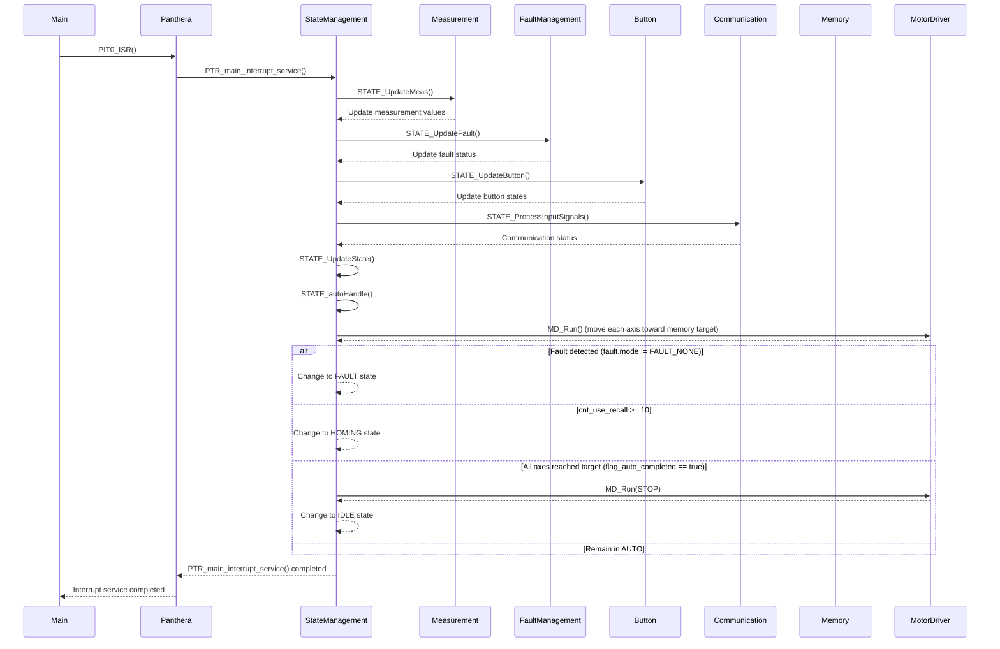

```mermaid
sequenceDiagram
    participant Main as Main
    participant App as Panthera
    participant State as StateManagement
    participant Meas as Measurement
    participant Fault as FaultManagement
    participant Btn as Button
    participant Comm as Communication
    participant Mem as Memory
    participant Motor as MotorDriver

    Main->>App: PIT0_ISR()
    App->>State: PTR_main_interrupt_service()
    State->>Meas: STATE_UpdateMeas()
    Meas-->>State: Update measurement values
    State->>Fault: STATE_UpdateFault()
    Fault-->>State: Update fault status
    State->>Btn: STATE_UpdateButton()
    Btn-->>State: Update button states
    State->>Comm: STATE_ProcessInputSignals()
    Comm-->>State: Communication status
    State->>State: STATE_UpdateState()

    %% AUTO state logic
    State->>State: STATE_autoHandle()
    State->>Motor: MD_Run() (move each axis toward memory target)
    Motor-->>State:
    alt Fault detected (fault.mode != FAULT_NONE)
        State-->>State: Change to FAULT state
    else cnt_use_recall >= 10
        State-->>State: Change to HOMING state
    else All axes reached target (flag_auto_completed == true)
        State->>Motor: MD_Run(STOP)
        Motor-->>State:
        State-->>State: Change to IDLE state
    else Remain in AUTO
    end
    State-->>App: PTR_main_interrupt_service() completed
    App-->>Main: Interrupt service completed
```