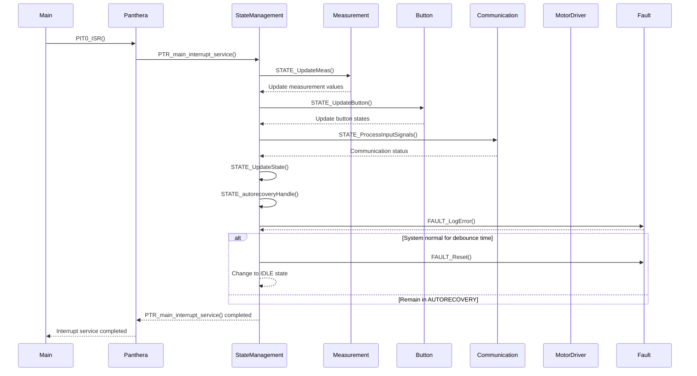

```mermaid
sequenceDiagram
    participant Main as Main
    participant App as Panthera
    participant State as StateManagement
    participant Meas as Measurement
    participant Btn as Button
    participant Comm as Communication
    participant Motor as MotorDriver

    Main->>App: PIT0_ISR()
    App->>State: PTR_main_interrupt_service()
    State->>Meas: STATE_UpdateMeas()
    Meas-->>State: Update measurement values

    State->>Btn: STATE_UpdateButton()
    Btn-->>State: Update button states
    State->>Comm: STATE_ProcessInputSignals()
    Comm-->>State: Communication status
    State->>State: STATE_UpdateState()

    %% AUTORECOVERY state logic
    State->>State: STATE_autorecoveryHandle()
    State->>Fault: FAULT_LogError()
    Fault-->>State:
    alt System normal for debounce time
        State->>Fault: FAULT_Reset()
        State-->>State: Change to IDLE state
    else Remain in AUTORECOVERY
    end
    State-->>App: PTR_main_interrupt_service() completed
    App-->>Main: Interrupt service completed
```