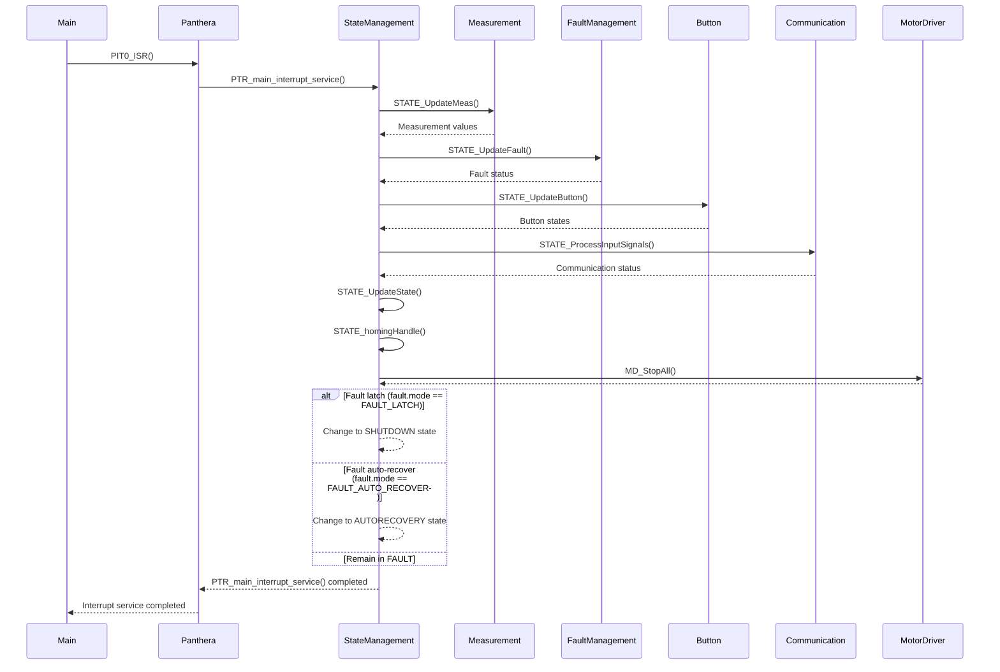

```mermaid
sequenceDiagram
    participant Main as Main
    participant App as Panthera
    participant State as StateManagement
    participant Meas as Measurement
    participant Fault as FaultManagement
    participant Btn as Button
    participant Comm as Communication
    participant Motor as MotorDriver

    Main->>App: PIT0_ISR()
    App->>State: PTR_main_interrupt_service()
    State->>Meas: STATE_UpdateMeas()
    Meas-->>State: Measurement values

    State->>Fault: STATE_UpdateFault()
    Fault-->>State: Fault status

    State->>Btn: STATE_UpdateButton()
    Btn-->>State: Button states

    State->>Comm: STATE_ProcessInputSignals()
    Comm-->>State: Communication status

    State->>State: STATE_UpdateState()
    State->>State: STATE_homingHandle()

    %% FAULT state logic
    State->>Motor: MD_StopAll()
    Motor-->>State:

    alt Fault latch (fault.mode == FAULT_LATCH)
        State-->>State: Change to SHUTDOWN state
    else Fault auto-recover (fault.mode == FAULT_AUTO_RECOVER)
        State-->>State: Change to AUTORECOVERY state
    else Remain in FAULT
    end

    State-->>App: PTR_main_interrupt_service() completed
    App-->>Main: Interrupt service completed
```
