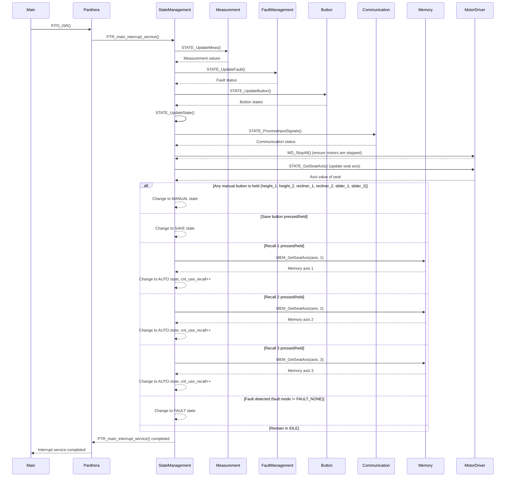

```mermaid
sequenceDiagram
    participant Main as Main
    participant App as Panthera
    participant State as StateManagement
    participant Meas as Measurement
    participant Fault as FaultManagement
    participant Btn as Button
    participant Comm as Communication
    participant Mem as Memory
    participant Motor as MotorDriver

    Main->>App: PIT0_ISR()
    App->>State: PTR_main_interrupt_service()
    State->>Meas: STATE_UpdateMeas()
    Meas-->>State: Measurement values

    State->>Fault: STATE_UpdateFault()
    Fault-->>State: Fault status

    State->>Btn: STATE_UpdateButton()
    Btn-->>State: Button states
    
    State->>State: STATE_UpdateState()

    State->>Comm: STATE_ProcessInputSignals()
    Comm-->>State: Communication status

    State->>Motor: MD_StopAll() (ensure motors are stopped)
    Motor-->>State:

    State->>Motor: STATE_GetSeatAxis() (update seat axis)
    Motor-->>State: Axis value of seat

    %% Điều kiện chuyển state từ IDLE (xét ở cuối)
    alt Any manual button is held (height_1, height_2, recliner_1, recliner_2, slider_1, slider_2)
        State-->>State: Change to MANUAL state
    else Save button pressed/held
        State-->>State: Change to SAVE state
    else Recall 1 pressed/held
        State->>Mem: MEM_GetSeatAxis(axis, 1)
        Mem-->>State: Memory axis 1
        State-->>State: Change to AUTO state, cnt_use_recall++
    else Recall 2 pressed/held
        State->>Mem: MEM_GetSeatAxis(axis, 2)
        Mem-->>State: Memory axis 2
        State-->>State: Change to AUTO state, cnt_use_recall++
    else Recall 3 pressed/held
        State->>Mem: MEM_GetSeatAxis(axis, 3)
        Mem-->>State: Memory axis 3
        State-->>State: Change to AUTO state, cnt_use_recall++
    else Fault detected (fault.mode != FAULT_NONE)
        State-->>State: Change to FAULT state
    else Remain in IDLE
    end
    State-->>App: PTR_main_interrupt_service() completed
    App-->>Main: Interrupt service completed
```