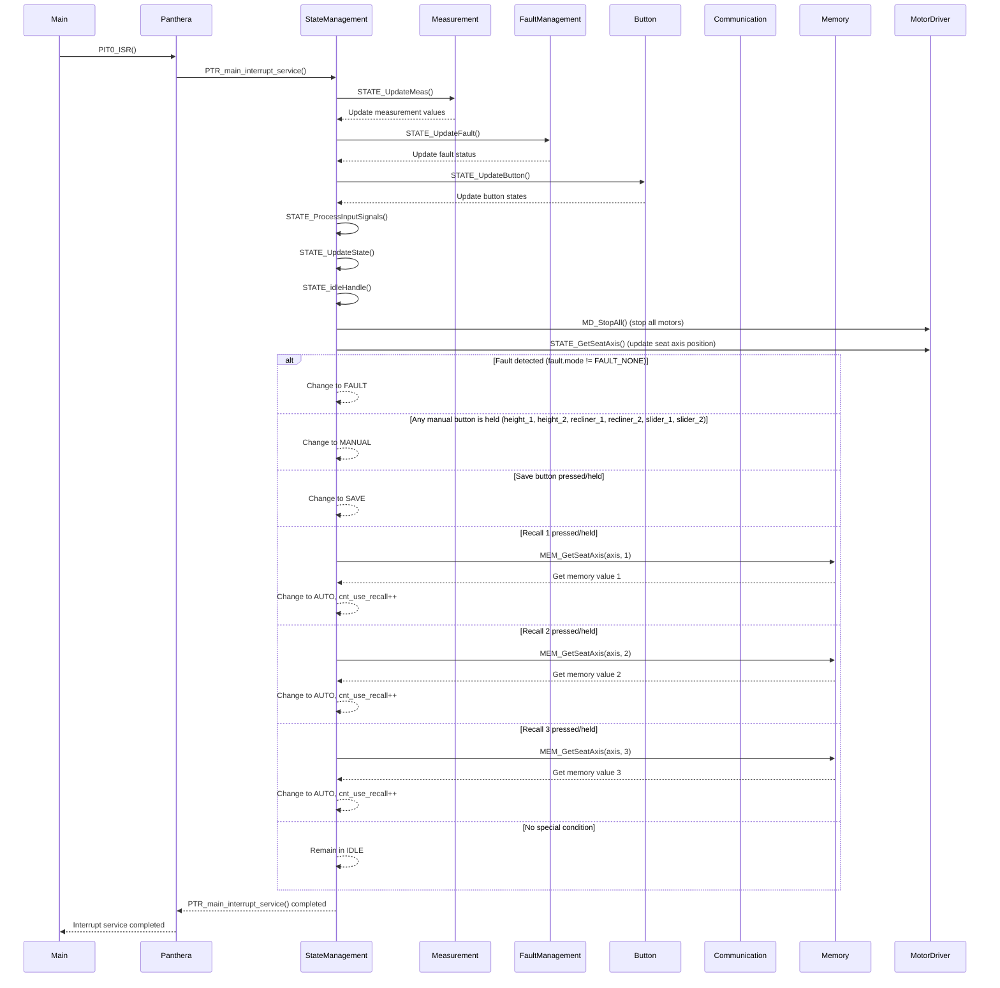

```mermaid
sequenceDiagram
    participant Main as Main
    participant App as Panthera
    participant State as StateManagement
    participant Meas as Measurement
    participant Fault as FaultManagement
    participant Btn as Button
    participant Comm as Communication
    participant Mem as Memory
    participant Motor as MotorDriver

    Main->>App: PIT0_ISR()
    App->>State: PTR_main_interrupt_service()
    State->>Meas: STATE_UpdateMeas()
    Meas-->>State: Update measurement values
    State->>Fault: STATE_UpdateFault()
    Fault-->>State: Update fault status
    State->>Btn: STATE_UpdateButton()
    Btn-->>State: Update button states
    State->>State: STATE_ProcessInputSignals()
    State->>State: STATE_UpdateState()
    State->>State: STATE_idleHandle()
    State->>Motor: MD_StopAll() (stop all motors)
    State->>Motor: STATE_GetSeatAxis() (update seat axis position)
    alt Fault detected (fault.mode != FAULT_NONE)
        State-->>State: Change to FAULT
    else Any manual button is held (height_1, height_2, recliner_1, recliner_2, slider_1, slider_2)
        State-->>State: Change to MANUAL
    else Save button pressed/held
        State-->>State: Change to SAVE
    else Recall 1 pressed/held
        State->>Mem: MEM_GetSeatAxis(axis, 1)
        Mem-->>State: Get memory value 1
        State-->>State: Change to AUTO, cnt_use_recall++
    else Recall 2 pressed/held
        State->>Mem: MEM_GetSeatAxis(axis, 2)
        Mem-->>State: Get memory value 2
        State-->>State: Change to AUTO, cnt_use_recall++
    else Recall 3 pressed/held
        State->>Mem: MEM_GetSeatAxis(axis, 3)
        Mem-->>State: Get memory value 3
        State-->>State: Change to AUTO, cnt_use_recall++
    else No special condition
        State-->>State: Remain in IDLE
    end
    State-->>App: PTR_main_interrupt_service() completed
    App-->>Main: Interrupt service completed
```