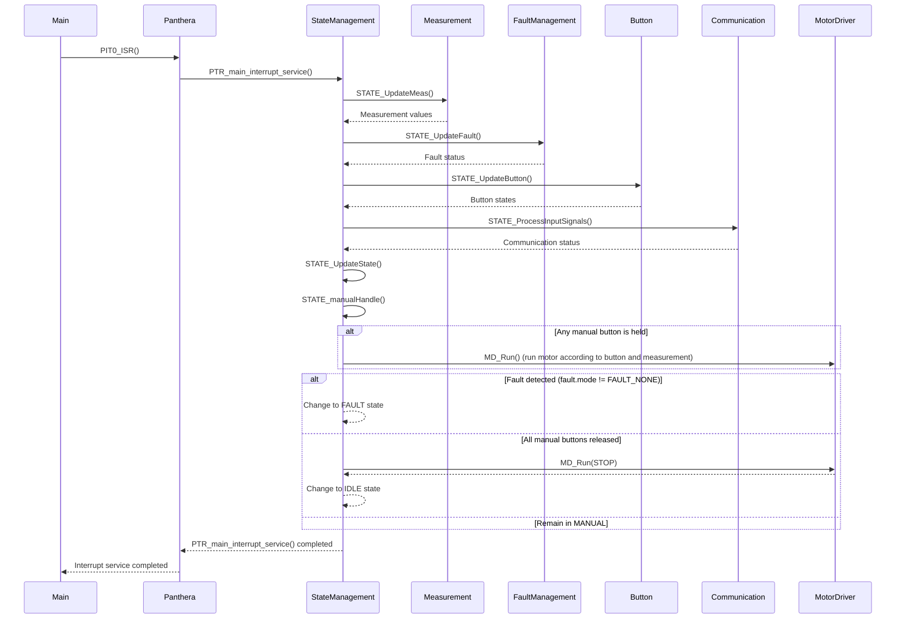

```mermaid
sequenceDiagram
    participant Main as Main
    participant App as Panthera
    participant State as StateManagement
    participant Meas as Measurement
    participant Fault as FaultManagement
    participant Btn as Button
    participant Comm as Communication
    participant Motor as MotorDriver

    Main->>App: PIT0_ISR()
    App->>State: PTR_main_interrupt_service()
    State->>Meas: STATE_UpdateMeas()
    Meas-->>State: Measurement values

    State->>Fault: STATE_UpdateFault()
    Fault-->>State: Fault status

    State->>Btn: STATE_UpdateButton()
    Btn-->>State: Button states

    State->>Comm: STATE_ProcessInputSignals()
    Comm-->>State: Communication status

    State->>State: STATE_UpdateState()

    State->>State: STATE_manualHandle()

    alt Any manual button is held
        State->>Motor: MD_Run() (run motor according to button and measurement)
    end

    %% MANUAL state logic
    alt Fault detected (fault.mode != FAULT_NONE)
        State-->>State: Change to FAULT state
    else All manual buttons released
        State->>Motor: MD_Run(STOP)
        Motor-->>State:
        State-->>State: Change to IDLE state
    else Remain in MANUAL
    end

    State-->>App: PTR_main_interrupt_service() completed
    App-->>Main: Interrupt service completed
```