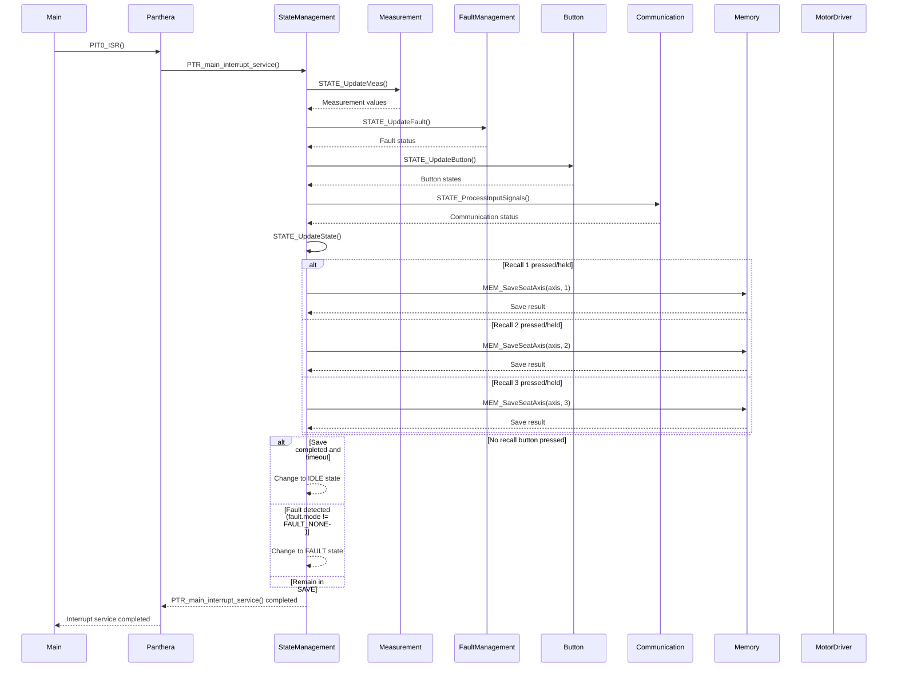

```mermaid
sequenceDiagram
    participant Main as Main
    participant App as Panthera
    participant State as StateManagement
    participant Meas as Measurement
    participant Fault as FaultManagement
    participant Btn as Button
    participant Comm as Communication
    participant Mem as Memory
    participant Motor as MotorDriver

    Main->>App: PIT0_ISR()
    App->>State: PTR_main_interrupt_service()
    State->>Meas: STATE_UpdateMeas()
    Meas-->>State: Measurement values

    State->>Fault: STATE_UpdateFault()
    Fault-->>State: Fault status

    State->>Btn: STATE_UpdateButton()
    Btn-->>State: Button states

    State->>Comm: STATE_ProcessInputSignals()
    Comm-->>State: Communication status

    State->>State: STATE_UpdateState()

    %% SAVE state logic
    alt Recall 1 pressed/held
        State->>Mem: MEM_SaveSeatAxis(axis, 1)
        Mem-->>State: Save result
    else Recall 2 pressed/held
        State->>Mem: MEM_SaveSeatAxis(axis, 2)
        Mem-->>State: Save result
    else Recall 3 pressed/held
        State->>Mem: MEM_SaveSeatAxis(axis, 3)
        Mem-->>State: Save result
    else No recall button pressed
        %% Không lưu vị trí
    end

    alt Save completed and timeout
        State-->>State: Change to IDLE state
    else Fault detected (fault.mode != FAULT_NONE)
        State-->>State: Change to FAULT state
    else Remain in SAVE
    end

    State-->>App: PTR_main_interrupt_service() completed
    App-->>Main: Interrupt service completed
```
