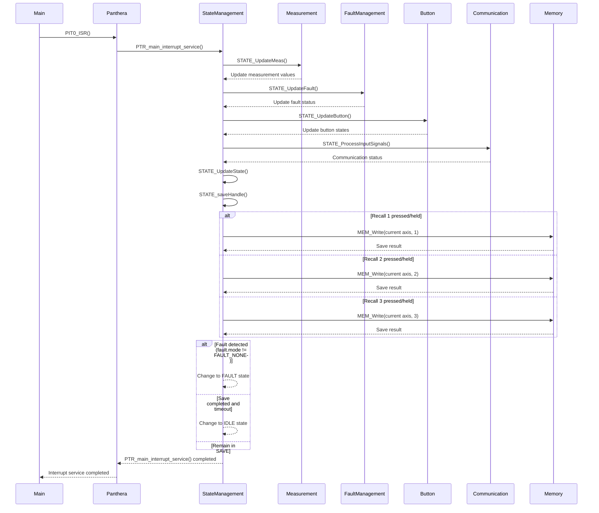

```mermaid
sequenceDiagram
    participant Main as Main
    participant App as Panthera
    participant State as StateManagement
    participant Meas as Measurement
    participant Fault as FaultManagement
    participant Btn as Button
    participant Comm as Communication
    participant Mem as Memory

    Main->>App: PIT0_ISR()
    App->>State: PTR_main_interrupt_service()
    State->>Meas: STATE_UpdateMeas()
    Meas-->>State: Update measurement values
    State->>Fault: STATE_UpdateFault()
    Fault-->>State: Update fault status
    State->>Btn: STATE_UpdateButton()
    Btn-->>State: Update button states
    State->>Comm: STATE_ProcessInputSignals()
    Comm-->>State: Communication status

    State->>State: STATE_UpdateState()
    State->>State: STATE_saveHandle()

    %% SAVE state logic
    alt Recall 1 pressed/held
        State->>Mem: MEM_Write(current axis, 1)
        Mem-->>State: Save result
    else Recall 2 pressed/held
        State->>Mem: MEM_Write(current axis, 2)
        Mem-->>State: Save result
    else Recall 3 pressed/held
        State->>Mem: MEM_Write(current axis, 3)
        Mem-->>State: Save result
    end

    alt Fault detected (fault.mode != FAULT_NONE)
        State-->>State: Change to FAULT state
    else Save completed and timeout
        State-->>State: Change to IDLE state
    else Remain in SAVE
    end

    State-->>App: PTR_main_interrupt_service() completed
    App-->>Main: Interrupt service completed
```