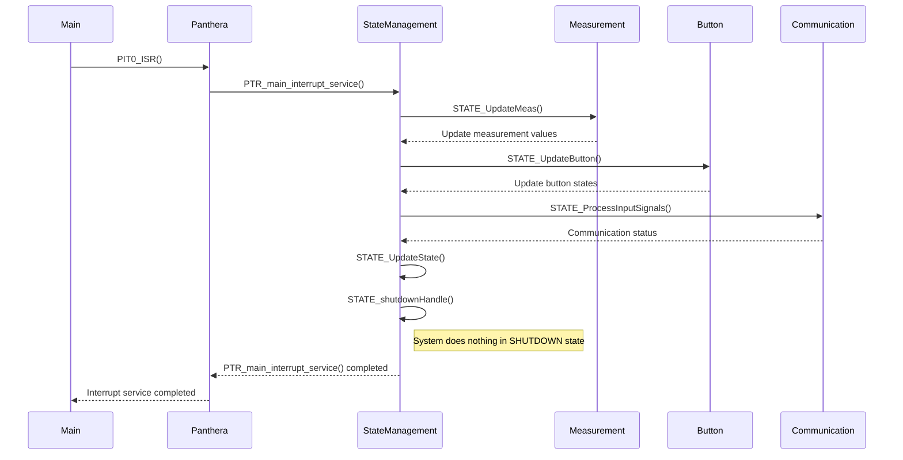

```mermaid
sequenceDiagram
    participant Main as Main
    participant App as Panthera
    participant State as StateManagement
    participant Meas as Measurement
    participant Btn as Button
    participant Comm as Communication


    Main->>App: PIT0_ISR()
    App->>State: PTR_main_interrupt_service()
    State->>Meas: STATE_UpdateMeas()
    Meas-->>State: Update measurement values
    State->>Btn: STATE_UpdateButton()
    Btn-->>State: Update button states
    State->>Comm: STATE_ProcessInputSignals()
    Comm-->>State: Communication status
    State->>State: STATE_UpdateState()

    %% SHUTDOWN state logic
    State->>State: STATE_shutdownHandle()
    Note right of State: System does nothing in SHUTDOWN state
    State-->>App: PTR_main_interrupt_service() completed
    App-->>Main: Interrupt service completed
```